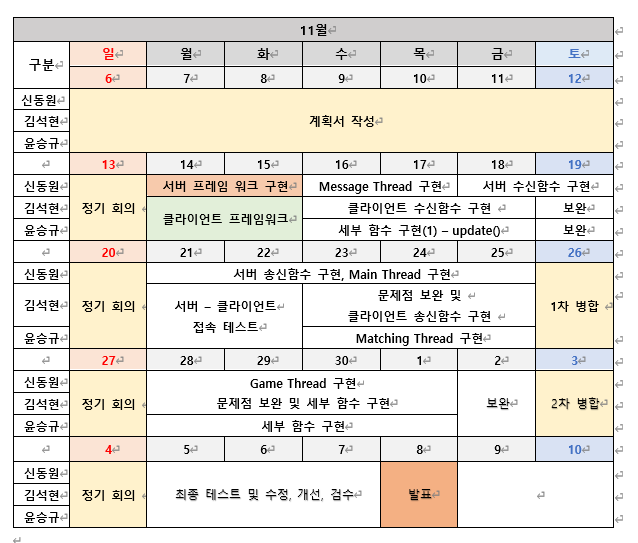

# 넷겜플 추진계획서
팀원 : 윤승규   신동원  김석현

### 목차
1. 게임 기획
    1. 게임 개요
    2. 구현 내용
    3. 조작 방법
2. High Level Design
    1. 서버
    2. 클라이언트
    3. 서버-클라이언트 관계도
3. Low Level Design
    1. 서버
    2. 클라이언트
4. 팀원 역할
5. 개발 일정

### 1.	게임 기획
1. 게임 개요
- 게임: 봄버맨 모작게임
- 플랫폼: PC
- 규칙: 2명의 플레이어가 일정 시간 후에 폭발하여 4방위로 일정 영역에 데미지를 입히는 폭탄을 설치해 상대를 공격, 최종 생존자 1명이 승리.
- 참고용 스크린샷 

2.	구현 내용
- 클라이언트
    + 타이틀 씬
        * 게임 시작 및 매칭
    + 게임 씬
        * 플레이어 - 이동, 폭탄 설치
        * 게임 정보 수신 및 display
        * 승패 여부 판단
- 서버
    + 메인 스레드
        * 매칭 스레드 생성
        * 매칭 스레드에 클라이언트 연결
        * 업데이트를 담당할 게임 스레드 생성 및 환경 구성
    + 매칭 스레드
        * 매칭 환경 구성
        * 각 클라이언트를 담당할 메세지 스레드 생성 및 연결
    + 메세지 스레드
        * 클라이언트 입력 데이터 수신
        * 수신한 데이터를 게임 스레드에 업데이트
        * 업데이트된 게임 스레드의 정보를 클라이언트에 송신
    + 게임 스레드
        * 메세지 스레드를 통해 전달받은 데이터를 통해 연산
        * 연상 후 업데이트된 데이터를 메세지 스레드에 전달

3. 조작 방법
- 조작키
    + W, A, S, D    : 플레이어의 이동 방향키 
        * W - 위쪽 / A - 왼쪽 / S - 아래쪽 / D - 오른쪽
    + Space bar     : 플레이어의 위치에 폭탄을 설치한다.

### 2.	High level design
- 서버
    + TCP/IP 프로토콜 방식
    + 모듈 별 역할
        * main      : 매칭 스레드, 게임 스레드 생성 및 클라이언트 연결
        * matching  : 매칭 환경 구성 및 각 클라이언트 담당 메세지 스레드 생성 및 연결
        * message   : 클라이언트와 통신
        * game      : 수신 데이터를 통해 연산 및 업데이트 데이터 전달
- 클라이언트
    + 모듈 별 역할
        * title : 게임 시작 및 매칭
        * game  : 게임 플레이 및 서버와의 통신
- 서버-클라이언트 관계도 

### 3.	Low level design
- 서버
    + 통신 data 구조
            
            unsigned char ClientNum

            vector<SOCKET> MatchingQueue
            
            typedef struct ClientState
            {
                SOCKET ClientSocket
                bool ReadyState = 0
            }

            class SceneData
            {
                Private:
                PlayerStatus    m_playerStatus[MAX_PLAYER];
                MapData     m_mapData[MAP_SIZE][MAP_SIZE];
                Public:
                update();
                keyInput(SOCKET socket, KeyInput key)
            }

            struct PlayerStatus  
            {
                SOCKET playerSocket;
                char     speed;
                char     power;
                bool     isAlive;
            };

    + 함수 
        송신

                Recv_Con_data()     클라이언트 로부터 데이터 소켓을 전달받는 함수
                Recv_input_data()   클라이언트 로부터 입력 데이터를 받는 함수
                Recv_check_state()  클라이언트로부터 실시간으로 게임 상태를 확인하도록 요청 받아 확인하는 함수

        수신

                Send_Con_data()     클라이언트 에 데이터 소켓을 전달하는 함수
                Send_draw_data()    서버에서 Update 처리한 데이터를 클라이언트에 보내는 함수 
                send_check()        2명의 player의 상태를 보내는 함수

        처리

                Change_status()     게임의 상태를 play, wait, end 로 바꿔주는 함수   
                Check_player()      2명의 player가 서버와 연결되어 준비상태인지 확인하는 함수
                Update()            입력 받은 데이터를 확인해 최신화 하는 함수
                Check_state()       게임의 진행 상황을 서버가 확인하도록 요청하는 함수
                Timeout()           일정시간 안에 입력 데이터의 전송이 되지 않고 지연 시 False로 처리하는 함수

    + 변수
        
            struct Point
            {
                short x;
                short y;
            };

            struct PlayerStatus
            {
                KeyInput    key;        
                char        speed;      // 플레이어 속도
                char        power;      // 폭탄 길이
                Point       position;   // 플레이어 위치
                bool        isAlive;    // 생존 여부
            };

            struct MapData
            {
                Bool    isRock
                Bool    isBubble;
            };

- 클라이언트
    + 통신 data 구조
        
            struct KeyInput
            {
                bool key_UP;
                bool key_Down;
                bool key_Left;
                bool key_Right;
                bool key_Space;
            };

    + 함수 
        송신

                Recv_Con_data()     서버 로부터 데이터 소켓을 전달받는 함수
                Recv_draw_data()    서버에서 받은 Update 데이터를 그리는 함수
                Recv_check()        Player가 모두 준비되었는지 데이터를 받는 함수

        수신

                Send_Con_data()     서버에 데이터 소켓을 전달하는 함수
                Send_input_data()   입력 받은 데이터를 서버에 전달하는 함수

        처리

                Change_status()     게임의 상태를 play, wait, end 로 바꿔주는 함수   
                Update()            입력받은 데이터를 확인해 최신화 하는 함수
                Check_state()       게임의 진행 상황을 서버가 확인하도록 요청하는 함수
                Timeout()           일정시간 안에 입력 데이터의 전송이 되지 않고 지연 시 False로 처리하는 함수

    + 변수
        
                enum Item
                {
                    EMPTY,      // empty
                    BALLON,     // 폭탄 개수 증가
                    SHOES,      // 플레이어 이동 속도 증가
                    POTION,     // 폭탄 길이 증가
                };

                enum PlayerColor
                {
                    RED,
                    GREEN,
                    BLUE,
                    PLAYEREMPTY,
                };

### 4.	팀원 역할
- 윤승규
    + 서버 송/수신 함수 구현
    + 클라이언트 송신 함수 구현
- 신동원
    + 서버 프레임 워크 구현
    + 송신 함수 구현
- 김석현
    + 클라이언트 프레임워크 구현
    + 수신 함수 구현
    + 문서 작성

### 5.	개발 일정

